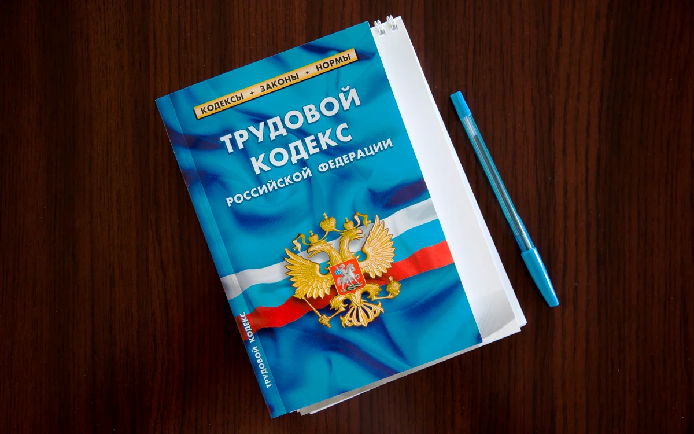

<!-- _paginate: false -->
<!-- _class: firstp -->
## Методы интеллектуального анализа данных

# Тополологический анализ статей Трудового кодекса РФ

Группа Data Scientist 



---

# Цель
> Инструментами Data Mining сравнить топологию статей из ТК РФ

# Задачи
>1. Расспарсить ТК РФ в структуру данных Python
>2. Определить/обучить для каждого предложения статьи вектор (sentence embedding) 
>3. Средставами Data Mining (например, Kepler Mapper) представить статью в виде облака точек 
>4. ...

---

# Парсер ТК РФ

```python
def get_text(filename):
  doc = docx.Document(filename)
  full_text = []
  current_chapter = ''
  for paragraph in doc.paragraphs:
    if paragraph.text!='':
      if paragraph.text.startswith('Статья') and current_chapter!='':
        full_text.append(current_chapter)
        current_chapter = ''

      if paragraph.text.endswith(('.', ';', ':')):
        current_chapter = current_chapter + paragraph.text
      else:
        current_chapter = current_chapter + paragraph.text + '.'
    
  return full_text
  
doc = get_text('/content/gdrive/My Drive/LabourCode.docx')
comments = get_text('/content/gdrive/My Drive/LabourCodeComments.docx')

labour_code=[]
for chapter in doc:
  chapter_number = chapter.split(' ', 2)[1]
  chapter_comments = [comment for comment in comments if comment.startswith('Статья ' + chapter_number)]
  result = chapter
  for comment in chapter_comments:
    result = result + comment
  labour_code.append(result)

print(labour_code[0])
```
```
'Статья 1. Цели и задачи трудового законодательства.Целями трудового законодательства являются установление...
```

---